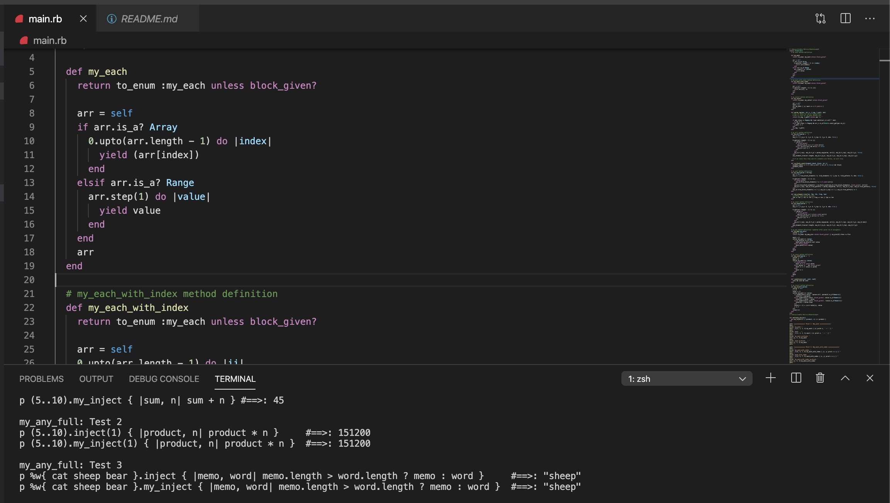

# Advanced Building Blocks - Enumerables

> This project adds my own version of enumerable methods onto the existing Enumerable module. In this project, I considered the full method definition included in [https://devdocs.io/ruby~2.6/enumerable](https://devdocs.io/ruby~2.6/enumerable), to replicate the same behavior in all defined possible conditions.

Implemented methods are as follow:
- #my_each
- #my_each_with_index
- #my_select
- #my_all?
- #my_any?
- #my_none?
- #my_count
- #my_map
- #my_inject
- #my_inject: Using #my_inject to build #multiply_els method
- #my_map method, modification to take procs
- #my_map refactoring so it takes procs and blocks

Each method is tested within the same code, after module definition.

## Built With

- Ruby
- VSCode

## Live Demo

## Getting Started

You can use the Repl.it link above to test to run the code and see all tests results included.

To get a local copy up and running follow these simple example steps.

### Prerequisites
    - You need to have ***Ruby*** installed on your machine ([Check this out](https://www.ruby-lang.org/en/documentation/installation/) for instructions on installing ruby)

### Usage
    To run the code go to the local folder where you have the *Ruby file* and run in the terminal `$ ruby file.rb` being 'file' the one you want to run

### Run tests
    - On the first method (`:bubble_sort`) you can change the given array where you call the method (just after the method definition).
    - On the second one (`:bubble_sort_by`) you can change the words inside the array (remember to separate them with spaces).

## Author

👤 **Carlos Anriquez**

- Github: [@canriquez](https://github.com/canriquez)
- Twitter: [@cranriquez](https://twitter.com/cranriquez)
- Linkedin: [linkedin](https://www.linkedin.com/in/carlosanriquez/)

## 🤝 Contributing

Contributions, issues and feature requests are welcome!

Feel free to check the [issues page](issues/).

## Show your support

Give a ⭐️ if you like this project!

## Acknowledgments

- Microverse
- The Odin Project
- The Corgis

## 📝 License

This project is [MIT](./LICENSE) licensed.
